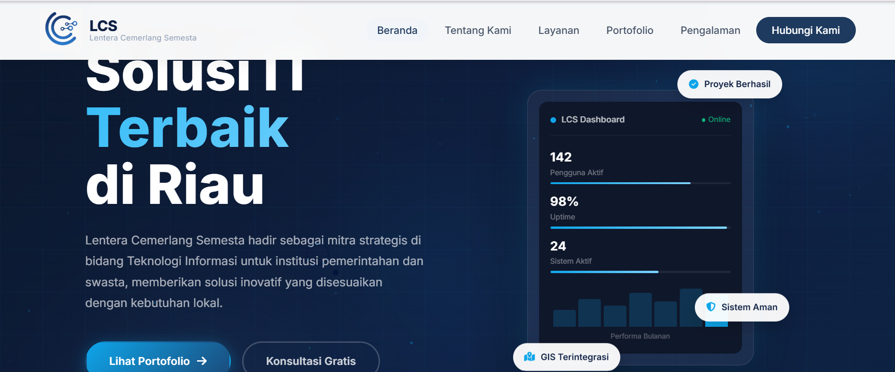
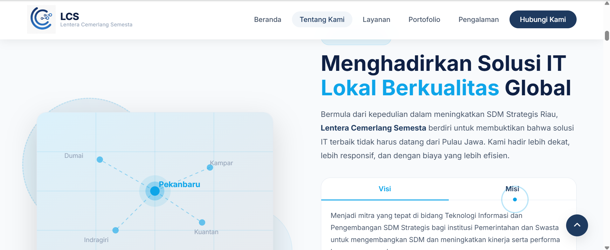
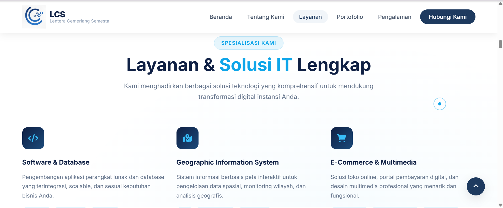
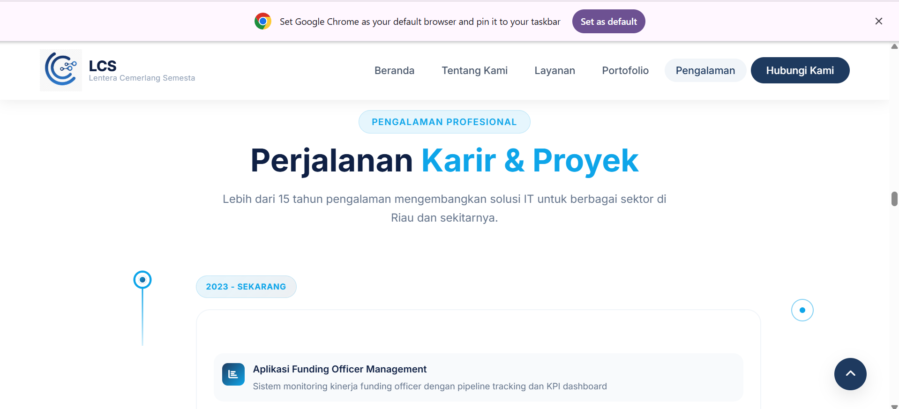
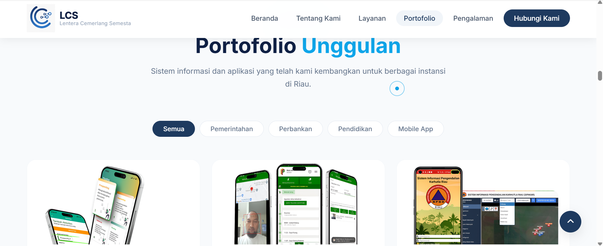
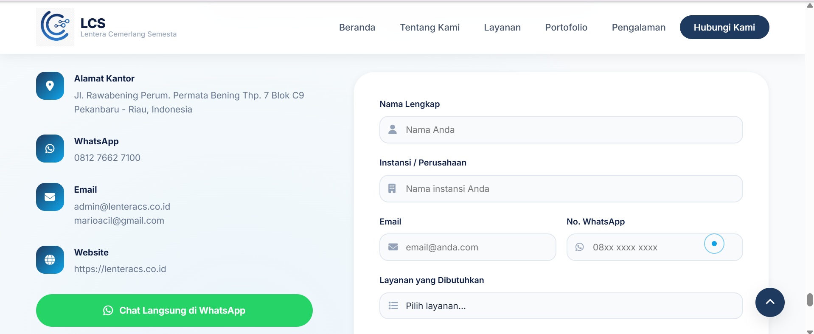
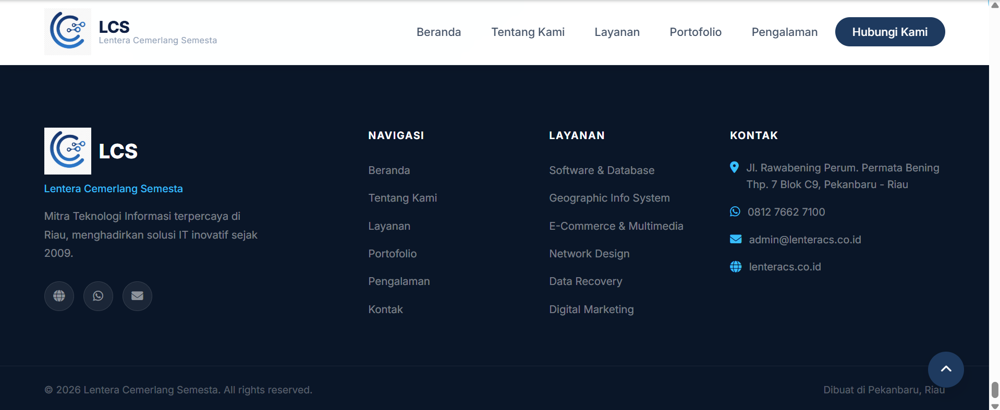

# 🌐 Company Profile

Website Company Profile yang dibangun menggunakan **Laravel 12** dengan tampilan modern, responsif, dan profesional.

## 📌 Deskripsi

Project ini merupakan website company profile yang bertujuan untuk memperkenalkan perusahaan melalui beberapa halaman utama, seperti Beranda, Tentang Kami, Layanan, Pengalaman, Portofolio, dan Hubungi Kami.

## ✨ Fitur

- 🏠 Beranda
- 👨‍💼 Tentang Kami
- 💼 Layanan
- ⭐ Pengalaman
- 📁 Portofolio
- 📞 Hubungi Kami
- 📍 Footer
- 📱 Responsive Design

## 🛠️ Teknologi yang Digunakan

- Laravel 12
- PHP 8.2
- Blade Template
- HTML5
- CSS3
- JavaScript
- Bootstrap
- Vite

## 📷 Tampilan Website

### Beranda


### Tentang Kami


### Layanan


### Pengalaman


### Portofolio


### Hubungi Kami


### Footer


## 🚀 Cara Menjalankan Project

### Clone Repository

```bash
git clone https://github.com/USERNAME/companyprofile.git
```

### Masuk ke Folder Project

```bash
cd companyprofile
```

### Install Dependency

```bash
composer install
npm install
```

### Konfigurasi Environment

```bash
cp .env.example .env
php artisan key:generate
```

Sesuaikan konfigurasi database pada file `.env`.

### Jalankan Migration

```bash
php artisan migrate
```

### Jalankan Project

Terminal 1

```bash
php artisan serve
```

Terminal 2

```bash
npm run dev
```

Buka browser:

```
http://127.0.0.1:8000
```

## 📁 Struktur Halaman

```
Home
├── About
├── Services
├── Experience
├── Portfolio
├── Contact
└── Footer
```

## 👩‍💻 Developer

**Indah Purnama**

SMK Negeri 7 Pekanbaru  
Rekayasa Perangkat Lunak (RPL)

---

⭐ Terima kasih telah mengunjungi repository ini.
